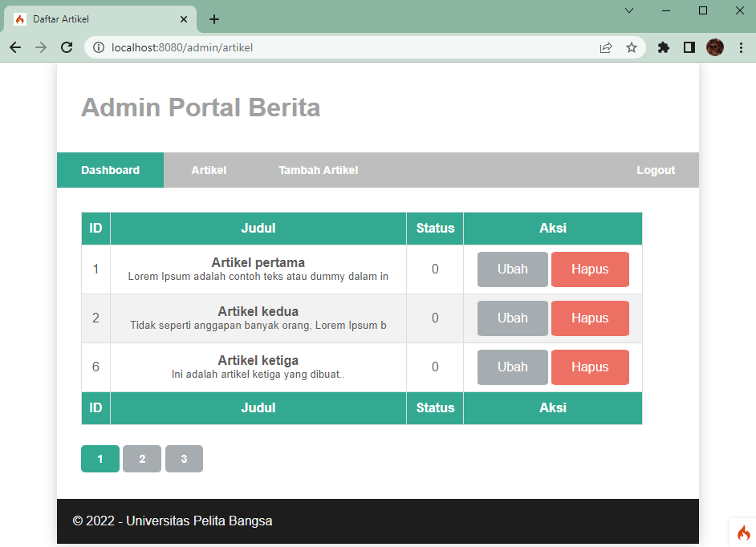
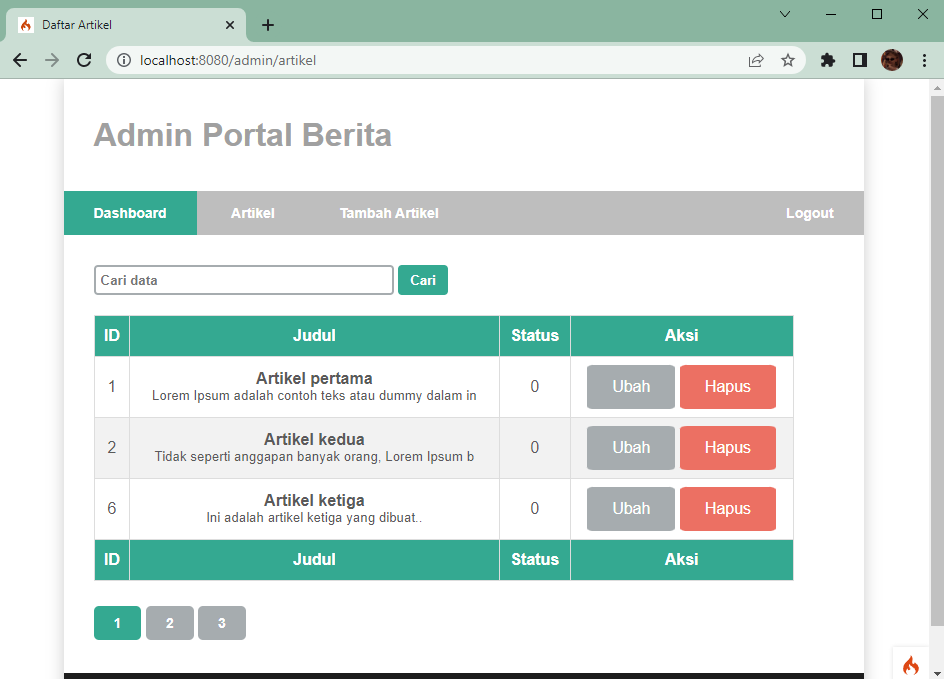
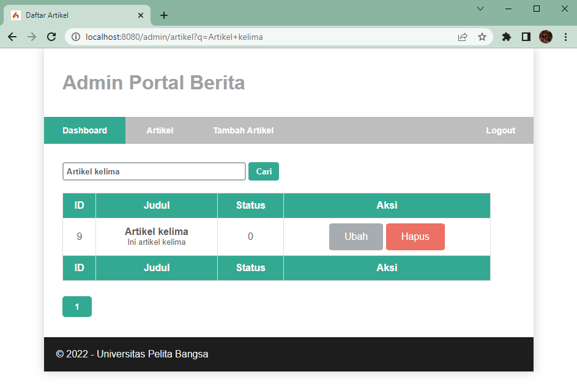
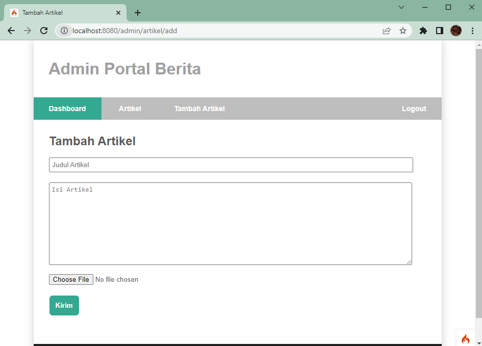

# Web14Lab14

**Nama : Aning Kinanti** <br>
**NIM : 312010364** <br>
**Kelas : TI.20.A2** <br>
**Matkul : Pemrograman Web** <br>

# Framework (Codeigneter 4) Lanjutan Pagination dan Pencarian

1. Buka kembali folder `lab11ci` pada htdocs
2. Jalankan xampp dan cli seperti pada penjelasan lab11web

## A. Membuat Fitur Pagination dan Search dengan CodeIgneter4

### 1. Membuat Pagination

Pagination berfungsi untuk membatasi tampilan yang panjang dari data yang banyak pada sebuah website. <br>
Buka Kembali Controller Artikel, kemudian modifikasi sintaks pada method admin_index seperti dibawah ini : <br>

```
public function admin_index()
{
    $title = 'Daftar Artikel';
    $model = new ArtikelModel();
    $data = [
        'title' => $title,
        'artikel' => $model->paginate(3), #data dibatasi 3 record per halaman
        'pager' => $model->pager,
    ];
    return view('artikel/admin_index', $data);
}

```

<br>

Kemudian buka file `views/artikel/admin_index.php` dan tambahkan dibawah deklarasi tabel data dengan sintaks seperti dibawah ini : <br>

```
<?= $pager->links(); ?>
```

<br>

Selanjutnya buka kembali menu daftar artikel, tambahkan data lagi untuk melihat hasilnya, maka tampilannya akan menjadi seperti dibawah ini : <br>
 <br>

### 2. Membuat Pencarian

Pencarian data digunakan untuk memfilter data. <br>
Untuk membuat pencarian data, buka kembali Controller Artikel, pada method admin_index ubah sintaks menjadi seperti berikut : <br>

```
    public function admin_index()
    {
        $title = 'Daftar Artikel';
        $q = $this->request->getVar('q') ?? '';
        $model = new ArtikelModel();
        $data = [
            'title' => $title,
            'q' => $q,
            'artikel' => $model->like('judul', $q)->paginate(3), # data dibatasi 3 record per halaman
            'pager' => $model->pager,
        ];
        return view('artikel/admin_index', $data);
    }
```

<br>

Kemudian buka kembali file `views/artikel/admin_index.php` dan tambahkan form pencarian sebelum deklarasi tabel dengan sintaks seperti berikut : <br>

```
<form method="get" class="form-search">
    <input type="text" name="q" value="<?= $q; ?>" placeholder="Cari data">
    <input type="submit" value="Cari" class="btn btn-primary">
</form>
```

<br>

Lalu ubah link pager menjadi seperti dibawah ini : <br>

```
<?= $pager->only(['q'])->links(); ?>
```

<br>

Selanjutnya buka kembali menu daftar artikel lakukan refresh pada halaman, maka akan muncul fitur search seperti dibawah ini : <br>
 <br>

Berikut adalah tampilan apabila fitur search digunakan : <br>
 <br>

### 3. Membuat Fitur Upload Gambar

Menambahkan fungsi unggah gambar pada tambah artikel. Buka kembali Controller
Artikel, sesuaikan sintaks pada method `add` menjadi seperti berikut : <br>

```
    public function add()
    {
        // validasi data.
        $validation = \Config\Services::validation();
        $validation->setRules(['judul' => 'required']);
        $isDataValid = $validation->withRequest($this->request)->run();

        if ($isDataValid) {
            $file = $this->request->getFile('gambar');
            $file->move(ROOTPATH . 'public/gambar');

            $artikel = new ArtikelModel();
            $artikel->insert([
                'judul' => $this->request->getPost('judul'),
                'isi' => $this->request->getPost('isi'),
                'slug' => url_title($this->request->getPost('judul')),
                'gambar' => $file->getName(),
            ]);
            return redirect('admin/artikel');
        }
        $title = "Tambah Artikel";
        return view('artikel/form_add', compact('title'));
    }
```

<br>

Kemudian pada file `views/artikel/form_add.php` tambahkan sintaks field input file seperti dibawah ini : <br>

```
<p>
    <input type="file" name="gambar">
</p>
```

<br>

Dan sesuaikan tag form dengan menambahkan ecrypt type seperti berikut :

```
<form action="" method="post" enctype="multipart/form-data">
```

<br>

Selanjutnya buka menu tambah artikel, maka tampilannya akan menjadi seperti dibawah ini : <br>
 <br>
